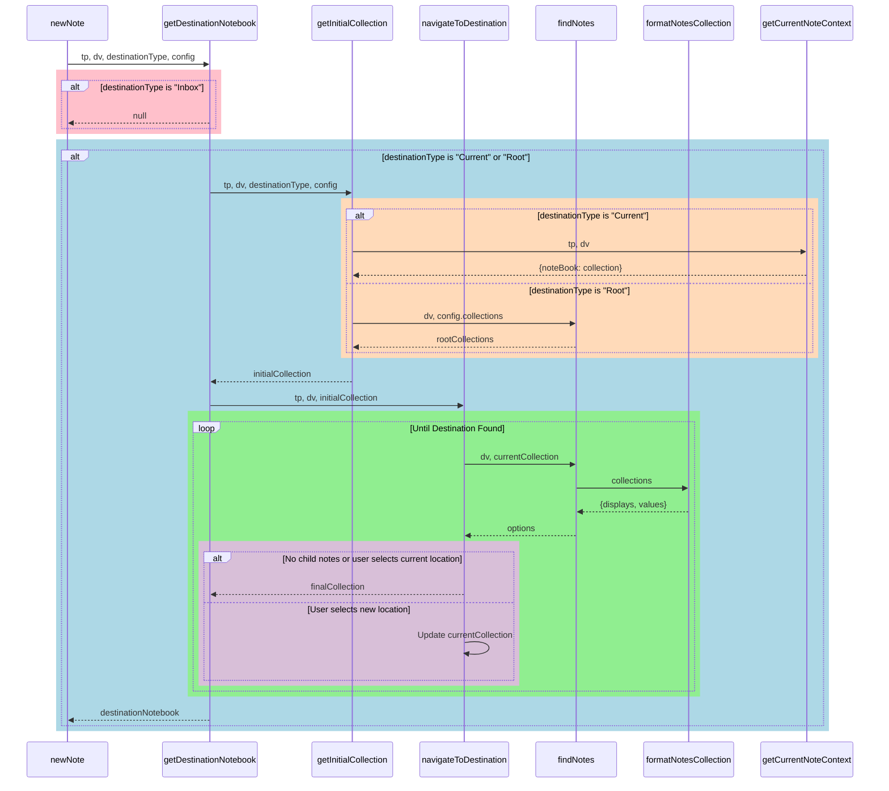

## Notebook Config

## Dev
- ![[2025-07-01T111338890-Pasted image 20250313161336.png|6000]]

## Collections -> **Notebooks**
- **Re-naming this entity to Notebooks because dear lord does it make more sense**
- Stores the names of the Collections present in this Notebook as links to Root Folder Note
	-  And I don't like this/ am working to change it because it makes it hard to set up a new Collection if you need to do it in multiple places
	- I wanted to be able to make a notebook file and then whenever a new note is made, it would see that file an provide the appropriate options for populating that notebook with the correct templates
- The reasonable solution here is to have both
	- Have a link in Config to the "Notebooks" folder - this is the easy default way to add new notebooks. Just anything in there
	- And then have YAML to link any other notebook files you want to have included

- This is really a conundrum - like I have notebook manager set up to apply the following frontmatter
	- General User and note creation information for everything
	- Destination notebook information
		- This is specifically the parent note and the noteBook this note was created in
		- **Are these helpful concepts**
			- You have insisted on including them because...
				- They make you not dependent on file hierarchy for groups of notes
					- I think setting a noteType does this
						- noteBooks + noteType should allow you to define many different templates (even if they share a name)
				- They allow you to put notes in multiple notebooks while still preserving the original location
					- Does that even matter?
						- Multiple notebooks is helpful and can be nice for cross filtering - depending on how difficult it is to manually assign the notebooks
					- But like do you care that much about the original location?
						- Or original parent?
						- Why does that matter?
							- It was for defining relationships between notes
				- I think it was also to try to solve the challenges associated with having YAML like
					- Projects, Topics, and People - that you want derived from specific lists and added to the correct notes
		- **Cons**
			- Without my scripting, I can't add these by default in bases (at least right now)

