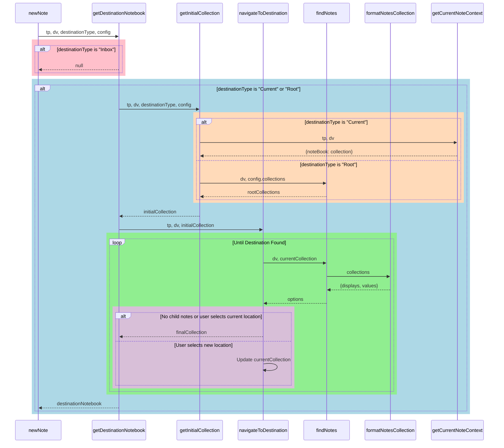

# Dev Log
## Feb 2026
### Actually setting up the Task management 
- Two types of information - Tasks and Actions
	- Actions are individual check boxes within a note
		- Generally individual Actions are only summarized within the note from which they originate
			- May see number of Actions/% completed summarized at a higher level
		- Actions are what Pomodoros are logged to
		- Actions can be recorded anywhere throughout a note and do not specifically need to be in the "Action Items" or "Tasks" section like I have done before
	- Tasks are Task notes that can have Actions of their own
		- Actions can be turned into Tasks
			- This uses the Leaf information for the Parent note to create the corresponding Task Note
		- Tasks can be forwarded to other notes
			- Assigns a new parent
			- And moves the note to the appropriate location
				- Not entirely positive on the implementation here
					- Probably easiest to copy the content and then create a new note that has that information from the new Parent
					- Need to check that "Existing" locations have valid Task Leaves and so it may be easiest to gather the appropriate folder information then and not need to re-create the note, which would be more elegant
- Task and Action summary 
	- Sections show up as they Exist for a given note
	- Tasks
		- Any Tasks that have this note as the Parent - could go deeper with this too
		- Displays the number of completed Actions/Total Actions
		- Button to Complete
		- Button (maybe URI) to Forward to a New or Existing Note
	- Actions
		- Actions from this Note 
			- Potentially Actions from any Related Notes
		- Buttons to Create a Task from this Action here or To create a Task in a different location (like a new or existing note)
		- Button to Complete the Action from this interface that marks the Completion Date by annotating the task
## Jan 2026
### Adding embedding options for leaves and branches
- Also used Claude
- Frequently had wanted to embed the new notes in the parent for creating a contiguous notebook that can be exported
	- Should also be useful for appending all of the the information about tasks in a folder note
- This is pretty adjustable - its per leaf type and can be set to prompt 
### Updating Leaves and Branches for array to single fields
- Updated this so that it would be easier to add attributes to new notes while using the same template based on the note from which it was generated
	- Specifically, using the same task template for Projects and Folder notes, where the projects should end up in a "Tasks" folder where the Folder note tasks should just go in the same folder
- This was updated with Claude 

### Working on Tasks
#### Organization of Tasks/Structuring Relationships
- How do you want Tasks to be stored wrt Folder Notes and Projects?
	- Current Context actually grabs the Parent note the current note so it doesn't necessarily work for adding a task inside a Folder Note right, it would add it to the Tasks folder for the Parent
##### Updated Current Context
- To resolve the first issue above, the current context now can recognize the difference between asking for the parent note and the current note and added a separate option for that
	- ![[2026-01-28T191756297-Pasted image 20260128191754.png|250]]
- 
#### Templates
- Made a default [[Task Template]] that is assigned in the [[Note Templates]] default
- Started on a Script to create new Tasks that will be the basis of a button in notes
	- Otherwise probably worth adding Tasks to the Leaf formats of projects and maybe Folder Notes so you can find the that way

### Daily and Monthly Notes
#### Made a new [[Daily Note Template]]
- Uses List Modified Plugin to track changes to notes
- Uses frontmatter for habit tracking
#### Monthly Note Base
- [[Monthly Note Base Template]]
- This is actually the text for a base not an embedded 
	- Probably need to change that
- Moved this to a Yearly note template because its kinda short to only keep track of these trends over 1 month. 
	- Obvi that's pretty changeable over time 

### MoodMeter
![[2026-01-13-MoodMeter]]
### Working on Forwarding Content
#### Removed the Embed in Content Option
- Some weirdness was going on where one option would embed the link to the forwarded content at the top of the "Content" (renamed to "Notes") section where as the other would Embed at the highlighted position/cursor position. 
	- Removed the former in favor of the latter
- Updated so that the headers are reduced a level when starting with a second level header so that the subsections embed as expected
- Updated so that the new header includes a link to the forwarded note to provide more clear two-way linking

#### Note on Forwarding Tasks if using Task Notes
- If tasks are individual notes, you will want to be able to move the Task Note itself to the desired location as well as linking the note properly
	- This somewhat overlaps with the need to update properties if moving a note to a new notebook
		- And likewise, what frontmatter to add when appending content to a different note
			- Like the note should be linked just by nature of doing it, but you had previously added something to the frontmatter and could easily add a relatives field if desired.

#### Identified a bug in Current Context
- Doesn't properly find Context when in a folder note or page
	- Currently references `currentNote.parent` which doesn't exist, while `currentNote.page.parent` should
		- However, this is an object
		- And notably, may contain multiple different parents which should be selectable 
		- Similar selections are made when invoking templates in selectNotebookTemplate

#### Imported old functions
- Added `forwardContenttoTarget`, `forwardTasktoTarget`, `embedLinkToContent` [sic] and the Forward Selection Templater command from 2023 Notebook Design Docs
	- Updated to use "#Notes" and "#Tasks" and then asked Claude to help update to use the logic seen in newNotes
		- Honestly, didn't do a bad job, but certainly isn't perfect
			- Issue with Context [[DevLog#Identified a bug in Current Context]]
			- Definitely too many separate scripts involved, don't like having the long templater command and Linking is not super clear or probably as desired
				- `appendContentToTarget` is still in the work space too and may clean up some of these issues, but also may be redundant
		- Created `selectExistingNote` to capture new note selection logic
			- Previously had used some heuristic for grabbing recent notes, which may also have some value

##### Forward Selection from 2023
``` JS
	const contentType = await tp.system.suggester(["Copy", "Cut", "Link", "Embed Here", "Embed in Content"], ["Copy", "Cut", "Link", "Embed Here", "Embed in Content"], false);
	if (contentType == "Copy") {
		tR += selection;
	} else if (contentType == "Cut") {
		tR += "";
	} else if (contentType == "Link") {
		const newContent = linkedHeading; 
		tR += newContent;
	} else if (contentType == "Embed Here") {
		const newContent = "!" + linkedHeading; 
		tR += newContent;
	} else if (contentType == "Embed in Content") {
		await tp.user.embedLinkToContent(tp, thisFile, newFile, newHeading, linkToHeading = true);
	}
	};
	} else {
	new Notice("Text not selected");
```

### Cleaned up old logs and added new functions
- Fixed multi-parent notes showing poorly in Dataview
	- Added filtering by index in notesQuery
- Added a function for converting a bullet hierarchy into a header
	- bulletsToHeader
	- Considering if its worth adding something to convert Headers back into bullets
		- Particularly since its easier to move bullets
		- Or maybe make something to move headers?
			- I've consider a "Select a header" func
				- And I think I used it for something before, but I don't remember what
## Dec 2025
### So what do we need to do now?
- Clean up function and variable naming, comments, console.logs 
- ~~Notes with Multiple Parents~~
	- Don't think Querying works right now
	- Display doesn't for two reasons
		- Duplicated in searches
		- Indented in the display
		- ![[2025-12-10T215545818-Pasted image 20251207153639.png]]
### Update and make any changes you want to GTD
- All of the Date Times, Parent and Notebook relationships need to be double checked and updated, since they are mostly used for the old system
- Annotating Tasks
	- Completion dates without using the Tasks plugin
	- Moving Tasks to another note
		- This was really pretty helpful ![[2025-12-10T215545912-Pasted image 20251207153203.png]]
	- Rescheduling 
	- Doing this with URI based buttons/click-ables
- Task Summary Data
	- Tracking Complete and Incomplete Tasks for a Note
	- Task Progress Bar for a Given Note or Collection of Notes
		- Relatedly, Distribution 
		- of Completed, Incomplete and Scheduled Tasks
- Create a Task Note template
	- Each Task has Actions (or action items or subtasks) which are just check boxes
		- Used to track completion percent of the task
		- Can add a Task with a URI button to Folder Note (or probably a Project)
			- ![[Pasted image 20251217115245.png]]
	- Pomodoro should make timeEntries when working on an Action that are reflected in the Task Frontmatter
		- Projects will summarize these timeEntires
	- Bases View - I think this is possible, not sure
		- The Obsidian Road map does not include Tasks in Bases, but does include Bases views as Calendar and Kanban
		- It is worth considering whether a more atomized task approach is actually the best solution going forward 
			- If you are going to use URI for completing, moving and rescheduling - I'm not sure it really makes sense to do it with Bases
				- Unless there is an elegant solution there
				- URIs don't work in the normal bases files, but do in the embeds - planned on being fixed relatively soon - https://forum.obsidian.md/t/in-base-files-local-uris-in-formulas-do-not-open/106878/8
		- Not sure exactly how one would manage various annotations like color coding, but maybe that's actually accomplishable 
			- Progress Bars in Bases 
				- ![[2025-12-10T220133922-Screenshot 2025-12-10 at 9.54.42 PM.png]]
	- Implement some learnings from Task Notes - https://github.com/callumalpass/tasknotes
		- A potentially useful example or add on depending on what seems most functionally useful
		- I don't particularly care for the implementation of having a single TaskNotes folder, though
			- Might be able to be toggled, but isn't a solution if it needs to be a set location for these to function
			- There is a default location and then you can have the task converted within a file which then adds it to the folder note, so that's easiy enough
		- The use of timeEntries is a good implementation however
			- Gets at pomodoro and change history in the same approach
				- Is it a feature if your change history isn't really stored if there isn't a pomo
			- ![[2025-12-10T215546038-Pasted image 20251210185639.png]]
		- Is there a reason that this doesn't work for you?
			- Like does the filtering not match with you how you want to do your notebook relationships 
			- Its definitely not perfect
				- The creation of subtasks that end up in the Default folder and not stored alongside the task is somewhat of an issue to me
				- Likewise, the fact that it will not actually trigger note creation with the standard method makes the rest of the templating not work the same for any "task" structure 
			- I'm somewhat curious if TaskForge will work without actually using tasking notes 
				- Seems like yes - https://taskforge.md/faq
				- Works with Obsidian "Tasks" as well
			- Where are you without it?
				- Somewhat annoying to make new Tasks without the convert inline task feature - which was kinda really nice
					- This sitting at the top of the task file and in the originating file is in fact convenient ![[Pasted image 20251210220912.png]]
					- Currently cannot apply a template when clicking new note in bases
						- Not sure thats on the road map and would likely need to come from the Templater plugin - so anyones guess
						- If you could apply a type checking based on the noteType that would probably work, but be hella clunky
				- I think still relatively convinced that a 1 note per task approach makes sense
- Calendar and Gantt View
### Work through some default architecture for different note types
- What would you like to include?
	- Collections (recipes, games, movies/shows)
		- Rename "Collection" in scripts and docs
			- Collection is kind of a mediocre name for the boarder category 
				- Like Recipes are a Collection, but Your Projects Notebook is something different
		- Creating a new Notebook/Collection 
			- I believe this is currently buried in the [[00 Config]] and is intended to be determined by the [[Notebooks]] folder
	- Projects
		- You had some stuff from prior versions that are worth reviewing to see if you wanna keep doing it
			- Embedding New note page files into the parent note
				- Not totally sure if this is necessary with both Bases and the DataviewJS approach
					- I believe this was somewhat because you wanted to be able to export these together for other people - outside of Obsidian
					- I think that is still a worthy goal, but I think that may be possible with static HTML (hosted or not)
			- Note Refactoring
				- Moving sections of a note to another note 
					- ![[DevLog#Forward Selection from 2023]]
				- Do you include some sort of Parentage update when Refactoring?
					- Seems reasonable to at least be an option
			- Pomodoro
				- Actively tracking tasks this way 
				- Aggregating statistics if possible
	- Inbox
		- Currently not easy to add types of notes to the inbox and serves as a catch-all
			- Newly created notes, any web clips (Read-it-later)
		- Has a base but doesn't really have a way to triage otherwise 
- Add custom templates for notes
	- Allow the templates to be stored somewhere other that in the Config folder for these
	- Allow (for example a project note) to include a custom branch or leaf template that is not assigned according to the note template
- Make it easier to look at your note templates 
	- I don't think the current traversalType for templates actually works right now
## QOL Improvements
- Update Hotkeys
	- What do I use all the time
		- Open in Finder
		- Toggle Source Mode
		- Move Folder - because of folder notes
- Heading and Bullets
	- ~~Toggle bulleted indentation to Headings~~
	- Insert Code in Bulleted List - Maybe obviated by relying on Headings More
- ~~Changelog and Modified Date~~
	- There are two general use cases here 
		- Navigating to what I was just working on
		- Seeing what I did on a particular date
	- This needs to be hard coded so that you don't lose it if its modified again in the future - sometimes called "burn-in"
		- The more this is handled by creating new notes (or modifying dated frontmatter) and running pomodoros that append timeEntries the easier this will be to track
- Update [[README]]
- Consolidate Historical DevLog (2023 onward) and Move to EM_XS Git

## Nov 2025
### Obsidian
- While there is definitely organizational stuff to do, I think there's only a bit of scripting to work on
- And then cleaning up the scripting because it takes a good 15 minutes+ to figure out what the hell I was doing the last time I touched it and its still got AI scars all over
#### Obsidian Relationship 
- I was working on getting the relationships correct so that the Tasks view would only display the tasks which were children (or whatever appropriate relationship) of the target note
##### Traversal Types
- You currently have some confusing business with the primary used relationship for everything being "children"
``` js
            children: {
                criteria: {
                    matchNoteBook: true,
                    isParent: true,
                    isBranch: true
                }
            },
```
- And I just added the "child_new" to try to capture what I'm actually looking for
``` js
            child_new: {
                criteria: {
                    isParent: true,
                    matchNoteBook: true,
                    isBranchOrLeaf: true
                }
            },
```
##### Criteria
- All relationships are defined by findNotesWithCriteria which is called through a single use function
	- getNotesForStrategy
		- Which basically just normalizes some inputs before calling fNWC and could likely be eliminated
``` js
			return Object.entries(collection).reduce((results, [category, referenceNotes]) => {
                // console.log(`Processing category: ${category} with ${referenceNotes.length} reference notes`);

                const foundNotes = referenceNotes.reduce((acc, referenceNote) => {     
                    // console.log(`Processing reference note: ${referenceNote.name}`);
                    // console.log("referenceNote", referenceNote)

                    const referenceNoteTypePath = referenceNote.noteType.path
                    const referenceNoteTypePage = dv.page(referenceNoteTypePath)

                    // if the referenceNote is a collection, then we will reference the root templates for that specific note
                    // otherwise we will use the branch templates as is defined in the Template defined by the noteType of the Reference Note

                    const branchTemplatePaths = this.isCollection(referenceNoteTypePath)
                        ? normalizePaths(referenceNote.page.rootTemplate)
                        : normalizePaths(referenceNoteTypePage.branchTemplate);
                        
                    const leafTemplatePaths = normalizePaths(referenceNoteTypePage?.leafTemplate);

                    const inlinks = referenceNote.page.file.inlinks || [];
                    const referenceParentPaths = normalizePaths(referenceNote.parent);

                   // console.log("collection?", this.isCollection(referenceNoteTypePath))
                   // console.log("branchTemplatePaths", branchTemplatePaths)
                   // console.log("referenceNote.page.rootTemplate", normalizePaths(referenceNote.page.rootTemplate))
                   // console.log("referenceNoteTypePage.branchTemplate", normalizePaths(referenceNoteTypePage.branchTemplate));

                    const matches = dv.pages()
                        .filter(page => {

                            const pageParentPaths = normalizePaths(page.parent);

                            const criteriaResults = {};

                            if (criteria.matchNoteBook) {
                                criteriaResults.matchNoteBook = 
                                    page.noteBook?.path === referenceNote.noteBook.path;
                            }

                            if (criteria.excludeNoteType) {
                                criteriaResults.excludeNoteType = 
                                    !(page.noteType?.path === referenceNote.noteType.path);
                            }

                            if (criteria.isParent) {
                                criteriaResults.isParent = 
                                    pageParentPaths.includes(referenceNote.path);
                            }

                            if (criteria.isSibling) {
                                criteriaResults.isSibling = 
                                    pageParentPaths.some(path => referenceParentPaths.includes(path));
                            }

                            if (criteria.isBranch) {
                                criteriaResults.isBranch = 
                                    page.noteType && branchTemplatePaths.includes(page.noteType.path);
                            }

                            if (criteria.isLeaf) {
                                criteriaResults.isLeaf = 
                                    page.noteType && leafTemplatePaths.includes(page.noteType.path);
                            }

                            if (criteria.isBranchOrLeaf) {
                                criteriaResults.isBranchOrLeaf = 
                                    page.noteType && (branchTemplatePaths.includes(page.noteType.path) ||
                                        leafTemplatePaths.includes(page.noteType.path))
                            }

                            if (criteria.isLinked) {
                                criteriaResults.isLinked = 
                                    inlinks.some(link => link.path === page.file.path);
                            }

                            // Check if all requested criteria pass
                            const matchesAll = Object.values(criteriaResults)
                                .every(result => result === true);

                            if (matchesAll) {
                                // console.log(`Found matching note: ${page.file.name}`, {
                                //     appliedCriteria: criteriaResults,  // Shows criteria that were checked
                                //     // branchTemplatePaths: branchTemplatePaths,
                                //     // page: page,
                                //     parent: page.parent,
                                //     noteType: page.noteType?.path,
                                //     noteBook: page.noteBook?.path
                                // });
                            }

                            return matchesAll;
                        })
                        .map(page => this.createNoteObject(dv, page.file.path));
                    
                    return [...acc, ...matches];
                }, []);
                
                // console.log("foundNotes", foundNotes)
                return foundNotes.length > 0 
                    ? { ...results, [category]: foundNotes }
                    : results;
            }, {});
```
##### Usage of Traversal Types
- " traversalType: "children" is used in three places (I'm not consistent about using the single and double quotes here, which is something to watch out for)
``` js
  async generateNoteTable(dv, targetNote, options = {}) {
        const {
            sortByCreated = true,
            limit = null
        } = options;

        const { DateTime } = dv.luxon;

        // Create initial collection structure
        const sourceCollection = {
            [targetNote.noteBook.display]: [targetNote]
        };

        // Use findNotes to get all related notes
        const relatedNotes = await this.traverseNotebook(dv, sourceCollection, {
            recursive: true,
            includeSource: true,
            formatOutput: false,
            traversalType: "children"
        });
```
``` js
    async getInitialCollection(tp, dv, destinationType, config) {
        switch (destinationType) {
            case "Current":
                // Get context from current note
                return await this.getCurrentNoteContext(tp, dv);
                
            case "Root":
                // Get root level collections and let user select
                // console.log("config.collections", config.collections)
                const rootCollections = await this.traverseNotebook(dv, config.collections, {
                    formatOutput: true,
                    includeSource: true,
                    traversalType: 'children'       
                });
```
``` js
    async navigateToDestination(tp, dv, initialCollection) {
        let currentCollection = initialCollection;
        
        // Helper function to check if two locations are the same
        const isSameLocation = (collection1, collection2) => {
            return Object.keys(collection1).some(key => 
                collection1[key].some(note1 => 
                    collection2[key]?.some(note2 => note2.path === note1.path)
                )
            );
        }

        while (true) {
            // Get and format navigation options
            const options = await this.traverseNotebook(dv, currentCollection, {
                includeSource: true,
                formatOutput: true,
                traversalType: 'children'
            });
```
``` js
    async getAllChildNotes(dv, sourceCollection) {
        // return this.findNotes(dv, rootCollections, {
        //     recursive: true
        // });

        let allChildNotes = await this.traverseNotebook(dv, sourceCollection, {
            recursive: true,
            includeSource: true,
            formatOutput: false,
            traversalType: 'child_new'
        });

        console.log("allChildNotes", allChildNotes)
        return allChildNotes
    }
```
- Both traversal types in use are finding notes that match both the parent and the notebook type
- Generally, `children` looks like its actually looking for "Branch" notes not all Child notes
- Whereas `child_new` is getting both leaf and branch
- Would be easy to rename `children` to `related_branches` and `child_new` to `child`
	- Possible that `child_branch` is actually better and more descriptive
	- So I will go with child_branch
#### Updating Dataviews 
- Updated both Multicolumn and GTD to include on the child notes based on the cleaned up relationships above
##### Previously
``` js
// let taskFilter = {noteType: { includePaths: targetNote.noteType.path }} 

// for (let cat in allChildNotes) {
//     taskFilter[cat] = {
//         includePaths: [targetNote.path],
//         excludePaths: []
//     };
//     for (let index in allChildNotes[cat]) {
//         taskFilter[cat].includePaths.push(String(allChildNotes[cat][index].path));
//     }
// }

// let subprojects = dv.pages()
//     .filter(p => notebookManager.dataFilter([p], taskFilter).length > 0)
```
##### Updated
``` js
let allChildNotes = await notebookManager.traverseNotebook(dv, nestedInput, {
    recursive: true,
    includeSource: true,
    formatOutput: false,
    traversalType: 'child_branch'
});

let subProjectPaths = Object.values(allChildNotes)
            .flat()
            .map(note => note.page?.file?.path ?? [])

let subprojects = dv.pages()
                    .file
                    .filter(p => subProjectPaths.includes(p.path))
```
- replaced the getAllChildNotes func in notebookManager with a better use of traverseNotebook followed by subsetting the included paths
	- This is probably inelegant because you are pulling each set of notes twice
		- Once to collect the project paths and again to subset them
		- I tried to take the allChildNotes object and extract the note information in a workable format, but I really struggled to get that right and this worked easily
	- Used this same approach in GTD
- Multicolumn_new also required an update resulting in notesQuery_new so that the specific traversal type could be queried
	- Added the argument "traversalType"
	- Had to ask GPT to troubleshoot the JSON.stringify line
``` js
function generateMultiColumnMarkdown(data) {
    // Validate input
    if (!Array.isArray(data) || data.length === 0) {
        throw new Error("Input must be a non-empty array");
    }

    let markdown = "";
    // "> [!multi-column]\n";

    data.forEach(obj => {
        // Assuming 'propertyName' and 'propertyValue' are hardcoded properties
        // Safer to do this so that they can be validated 
        console.log(obj)
        const propertyName = obj.name;
        const propertyLink = obj.link;

        // Check if the hardcoded properties exist in the object
        if (propertyName !== undefined && propertyLink !== undefined) {
            markdown += `> > [!${propertyName}]+ ${propertyName}\n`;
            markdown += `> > \`\`\`dataviewjs \n`;
            markdown += `> > dv.view("00 Config/Scripts/Dataview/notesQuery_new", {"target": ${JSON.stringify(propertyLink)}, "traversalType":"child"})\n`;
            markdown += `> > \`\`\`\n`;
            markdown += ">\n"; // Add a line break after each property
        }
    });

    return markdown;
}
```
##### Results
-  From "Project - Inside" 
	- ![[2025-12-10T215546102-Pasted image 20251207141148.png]]
	- ![[2025-12-10T215546163-Pasted image 20251207141210.png]]

## Oct 2025
- You have the opportunity to use Obsidian to structure your own project work here and get yourself back on track a bit
	- I don't hate how I've been using the inbox + bases to collect all of things things I've been thinking about 
		- But its definitely not elegant
- You need something to work on that actually engages your brain and moves you towards the world of doing work
	- Working with Javascript and your notebook architecture is certainly an opportunity to do that
		- I mean generally, thinking about computers and digital stuff makes you want to do that
	- Checked for Obsidian updates and fell down a Hex Mapping rabbit whole
		- [[2024-11-11-Hex Mapper Plugin]]
		- [[2025-10-20-Building Modular Hex Maps with Obsidian]]
		- But also really based on the new Bases update - https://help.obsidian.md/bases/views/map
			- Seems like it only really takes online maps for the moment, but could be really cool/easy/nice with Hex maps
				- Maybe made with https://thorbjorn.itch.io/tiled
				- And ideally imported from Text - i don't totally love using the https://github.com/modality/obsidian-text-mapper plugin rather than something official with bases
- How much value - for job hunting and job having do you think Obsidian is?
	- Getting a job
		- Like pretty small
			- Shows that I am a "tech" person, but I don't think that is incredibly valuable vs marketable skills
		- I think there are bases that would be a nice addition to a personal website
			- And I don't have a lot of other content for that
		- Javascript and templates could also be a useful demonstration of skills, but not if its AISlop and a mess to read
			- Its not horrible right now, but I don't think it is particularly good and your committing habits are bad
	- Having a Job
		- If I'm allowed to use it, I think this is generally a really helpful notebook/journaling tool and will continue to be useful to organize my thoughts
			- Particularly if I can integrate any semblance of a Pomodoro workflow that helps manage some ADHD tendencies and "collect" my work better
			- All of that isn't very useful in the lab though
			- It has been helpful as a method for collecting my thoughts on prior research and preserving them so that I can find it in the future
				- Mostly 
				- It certainly doesn't make my infallible or provide any super power
				- But I do think its better than OneNote
				- And the hope of some sort of project based organization is exactly what I want and necessary for keeping multiple disparate projects organized 
		- I think the project management aspect of what I wanted from Obsidian isn't to be lost either
			- I still like Mermaid and Gannt charts and collecting tasks for future work
			- That is also all related to doing Poms too - though taking it further than is entirely necessary
	- Outside of a job - still pretty useful and the notebook tool that I want to keep using
		- It keeps getting better and has all of the power to do the things I want
			- Capture information, posts and thoughts
			- Organize information
			- Be offline
			- Be usable for future GMing - which I think I do wanna do eventually - just not right now (not enough brainspace)
				- And just reading RPGs and PDFs and stuff
				- Worth asking if I want to worry about RPGs vs Academic PDFs and how to integrate with Zotero, but that is also a bigger question
					- And bigger library that I don't currently have the space to host on my laptop
						- Eh its only like 5gb - and it has been annoying to not be able to meaningfully download pdfs since I got rid of my work computer
						- I have like 24gb of RPGs downloaded on the computer, which is also far from ideal
- So what do you want to do with Obsidian?
	- I think I have work to do in order to use this for Work/Project Management 
		- And I'm not entirely sure what that is
	- I know there is work to do to use this a database of my various libraries
		- There is work both in and outside of Obsidian to facilitate that
## Pre Nov 2025
### Dev
- ![[2025-12-10T215546213-Pasted image 20250313161336.png|6000]]


### Collections -> **Notebooks**
- **Re-naming this entity to Notebooks because dear lord does it make more sense**
- Stores the names of the Collections present in this Notebook as links to Root Folder Note
	-  And I don't like this/ am working to change it because it makes it hard to set up a new Collection if you need to do it in multiple places
	- I wanted to be able to make a notebook file and then whenever a new note is made, it would see that file an provide the appropriate options for populating that notebook with the correct templates
- The reasonable solution here is to have both
	- Have a link in Config to the "Notebooks" folder - this is the easy default way to add new notebooks. Just anything in there
	- And then have YAML to link any other notebook files you want to have included

- This is really a conundrum - like I have notebook manager set up to apply the following frontmatter
	- General User and note creation information for everything
	- Destination notebook information
		- This is specifically the parent note and the noteBook this note was created in
		- **Are these helpful concepts**
			- You have insisted on including them because...
				- They make you not dependent on file hierarchy for groups of notes
					- I think setting a noteType does this
						- noteBooks + noteType should allow you to define many different templates (even if they share a name)
				- They allow you to put notes in multiple notebooks while still preserving the original location
					- Does that even matter?
						- Multiple notebooks is helpful and can be nice for cross filtering - depending on how difficult it is to manually assign the notebooks
					- But like do you care that much about the original location?
						- Or original parent?
						- Why does that matter?
							- It was for defining relationships between notes
				- I think it was also to try to solve the challenges associated with having YAML like
					- Projects, Topics, and People - that you want derived from specific lists and added to the correct notes
		- **Cons**
			- Without my scripting, I can't add these by default in bases (at least right now)
