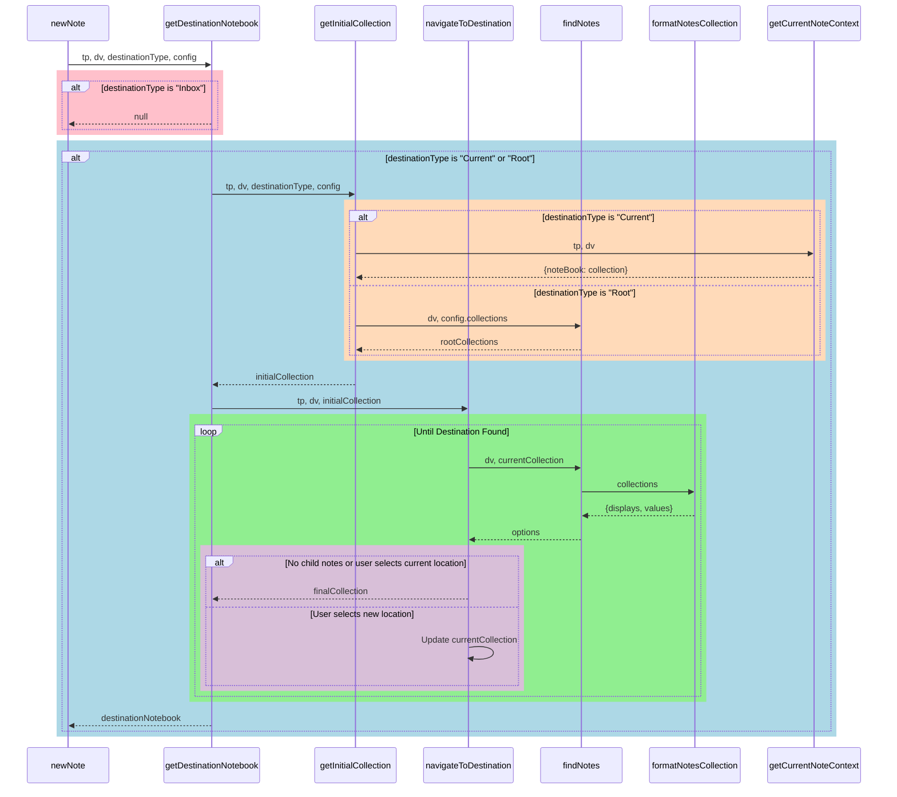

## Notebook Config
- ![[2025-03-13T161338024-Pasted image 20250313161336.png|6000]]

``` mermaid
sequenceDiagram

    participant newNote

    participant getDestinationNotebook

    participant getInitialCollection

    participant navigateToDestination

    participant findNotes

    participant formatNotesCollection

    participant getCurrentNoteContext

  

    newNote->>getDestinationNotebook: tp, dv, destinationType, config

    rect rgb(255, 192, 203)

    alt destinationType is "Inbox"

        getDestinationNotebook-->>newNote: null

    end

    end

  

    rect rgb(173, 216, 230)

    alt destinationType is "Current" or "Root"

        getDestinationNotebook->>getInitialCollection: tp, dv, destinationType, config

        rect rgb(255, 218, 185)

        alt destinationType is "Current"

            getInitialCollection->>getCurrentNoteContext: tp, dv

            getCurrentNoteContext-->>getInitialCollection: {noteBook: collection}

        else destinationType is "Root"

            getInitialCollection->>findNotes: dv, config.collections

            findNotes-->>getInitialCollection: rootCollections

        end

        end

  

        getInitialCollection-->>getDestinationNotebook: initialCollection

        getDestinationNotebook->>navigateToDestination: tp, dv, initialCollection

        rect rgb(144, 238, 144)

        loop Until Destination Found

            navigateToDestination->>findNotes: dv, currentCollection

            findNotes->>formatNotesCollection: collections

            formatNotesCollection-->>findNotes: {displays, values}

            findNotes-->>navigateToDestination: options

            rect rgb(216, 191, 216)

            alt No child notes or user selects current location

                navigateToDestination-->>getDestinationNotebook: finalCollection

            else User selects new location

                navigateToDestination->>navigateToDestination: Update currentCollection

            end

            end

        end

        end

        getDestinationNotebook-->>newNote: destinationNotebook

    end

    end
```

## Collections
- Stores the names of the Collections present in this Notebook as links to Root Folder Note

