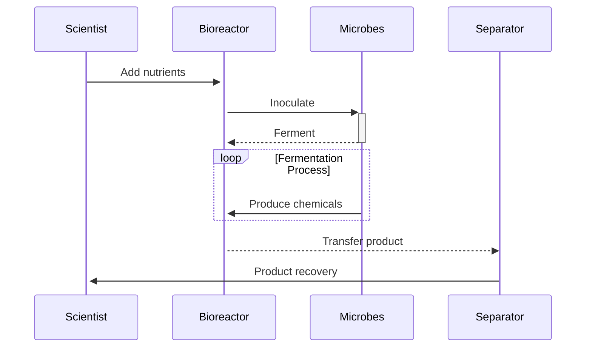
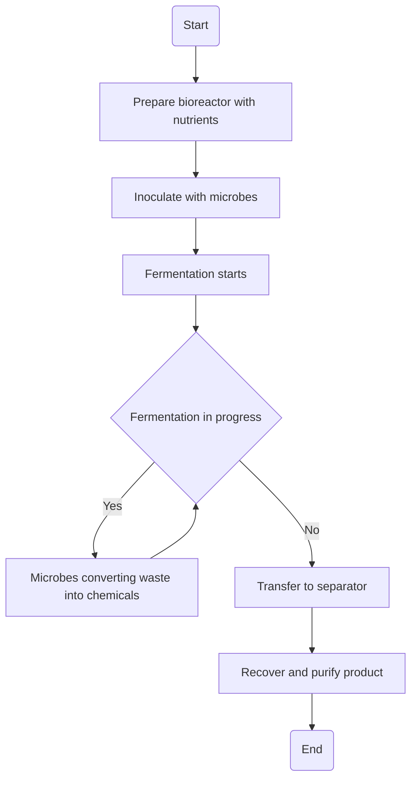

# Notes

## Looking at different diagramming options

### Mermaid JS
Certainly, I can help outline what those diagrams would look like for you. To give you a specific example, I'll use the simplified process of microbial production in a bioreactor – a process relevant to LanzaTech's work. This process will involve steps such as inoculation, fermentation, and product recovery. Remember that these diagrams will require the `mermaid` syntax to render in a supporting software or platform.

### Sequence Diagram

A sequence diagram represents the interactions between different entities (like microbes, bioreactors, and operators) in a sequential order. It emphasizes the order of operations and the communication between different parts of the system.



### Activity Diagram

An activity diagram focuses on the workflow or the activities involved in the process. It shows the sequence and conditions for coordinating lower-level behaviors, rather than which entities perform the activities.

```
%%{init: {'theme': 'base'}}%%
activityDiagram
    start
    :Prepare bioreactor with nutrients;
    :Inoculate with microbes;
    :Fermentation starts;
    while (Fermentation in progress) is (yes)
        :Microbes converting waste into chemicals;
    endwhile (no)
    :Transfer to separator;
    :Recover and purify product;
    stop
```

### Contrasting the Two Diagrams

**Sequence Diagram:**
- Emphasizes the interaction and exchange of messages between the system parts, such as the scientist, bioreactor, and microbes.
- Indicates the flow of time is from top to bottom, highlighting how each step waits for the previous step to complete.
- Outlines the communication pattern and the order in which operations are carried out.

**Activity Diagram:**
- Emphasizes the flow of control or the business logic.
- Branches and merges illustrate the choices and parallel processes involved in the system.
- Focuses on the sequence of activities and conditions governing the operations.

In summary, while a sequence diagram is useful for understanding the interactions between different components over time, an activity diagram provides a higher-level view of the process flow and decision points throughout the system. The sequence diagram depicts "who" does "what" and in what order, while the activity diagram is more about "what happens" and when it's done in terms of process steps.


``` mermaid
%%{init: {'theme': 'base'}}%%
activityDiagram
    start
    :Prepare bioreactor with nutrients;
    :Inoculate with microbes;
    :Fermentation starts;
    while (Fermentation in progress) is (yes)
        :Microbes converting waste into chemicals;
    endwhile (no)
    :Transfer to separator;
    :Recover and purify product;
    stop
```

Certainly! In Mermaid, an activity diagram can be closely emulated using a flowchart, which allows us to depict workflow and decision processes. Below is the Mermaid syntax for a flowchart representing the same process of microbial production in a bioreactor that I described earlier.



This flowchart shows the process starting with the preparation of the bioreactor and following through the steps of inoculation, fermentation, and the product recovery phase. Decision points are depicted with rhombuses (e.g., `Fermenting`), and the process flow is directed with arrows from one step to the next, ending with the process completion (`End`).

### Gantt in Mermaid

#### In GPT
To convert the provided DataViewJS script into a format that outputs a Gantt diagram using MermaidJS in Obsidian, you'll need to follow these steps:

1. Extract the relevant task data from the DataView queries, including the start and end dates for tasks.
2. Construct a MermaidJS Gantt chart code block that represents the extracted task data.

Below is an example of how you might alter the existing DataViewJS script to create a Gantt chart with MermaidJS. Note that you should ensure that the resulting script's variables and data match your task structure and properties.

```javascript
// Import Luxon variables from dv
const { DateTime } = dv.luxon;

// Output Gantt header
let ganttOutput = "```mermaid\n";
ganttOutput += "gantt\n";
ganttOutput += "dateFormat YYYY-MM-DD\n";
ganttOutput += "axisFormat %m-%d\n";

// Load Utilities
var dataviewUtils = require(app.vault.adapter.basePath + "/04 Resources/Notebook/Scripts/Dataview/utils.js");

// Fetch tasks from pages with proper attributes
const tasks = dv.pages()
    .where(page => page.task)
    .flatMap(page => page.file.tasks)
    .where(task => task.done !== true);

// Process each task into a Gantt chart section
for (let task of tasks) {
  // Ensure task has necessary properties like start and end dates
  if (task.scheduled && task.due) {
    // Determine section name and task detail text
    const sectionName = dataviewUtils.escapeGanttSectionName(task.project || "No Project");
    const detailText = task.text || "No description";

    // Format the dates for Gantt
    const startDate = DateTime.fromISO(task.scheduled).toISODate();
    const dueDate = DateTime.fromISO(task.due).toISODate();

    // Append to ganttOutput
    ganttOutput += `\tsection ${sectionName}\n`;
    ganttOutput += `\t\t${detailText} :${startDate}, ${dueDate}\n`;
  }
}

// Close the MermaidJS code block
ganttOutput += "```";

// Render the MermaidJS Gantt chart
dv.paragraph(ganttOutput);
```

What the script does:

- It starts with the `tasks` variable, retrieving pages with tasks and ensuring they are not completed (`task.done` is not `true`).
- For each task, if it has a `scheduled` and `due` date, it adds an entry in the Gantt chart.
- `dataviewUtils.escapeGanttSectionName` is a made-up function that you would need to implement or replace with real function calls, ensuring the strings used in the Gantt chart do not break the syntax (Mermaid syntax requires certain formatting rules).
- It writes out the Gantt diagram code using the MermaidJS syntax to `ganttOutput`.
- Finally, the script uses `dv.paragraph()` to append the complete Gantt chart to the current note in Obsidian.

Make sure to tailor the script to your actual task properties and ensure that you have an `escapeGanttSectionName` function in your `dataviewUtils` or implement an equivalent to sanitize section names for MermaidJS.

This script needs to be run within an Obsidian note that supports the execution of DataviewJS code blocks. Once rendered, you should see a Gantt chart representing your task schedule.

In Mermaid Gantt diagrams, section names are often used as titles for different categories of tasks or activities. These names must follow strict rules to maintain valid syntax, otherwise, they can break the diagram rendering. Here's a helper function that could be implemented in JavaScript to sanitize or escape section names for use in a Gantt diagram:

```javascript
function escapeGanttSectionName(name) {
  // Replace any sequence of characters that is not a letter, number, space
  // or underscore with a single dash.
  // Then trim whitespace from the start and end, and replace spaces with underscores.
  return name.replace(/[^\w\s]/g, '-').trim().replace(/\s+/g, '_');
}
```

This function works as follows:

1. It uses a regular expression to find any character sequences that are not letters (either uppercase or lowercase), digits, underscores, or spaces (`[^\w\s]`).
2. It replaces these sequences with a single hyphen (`-`), which is safe to use in section names.
3. It trims whitespace from the start and end of the string to avoid leading or trailing whitespace issues.
4. Finally, it replaces any remaining spaces with underscores, ensuring section names do not contain spaces, which can also cause issues.

Here's how you might incorporate the `escapeGanttSectionName` function into the script that you'd use in your Obsidian note:

```javascript
// Import Luxon variables from dv
const { DateTime } = dv.luxon;

// Function to sanitize section names for the Gantt chart
function escapeGanttSectionName(name) {
  return name.replace(/[^\w\s]/g, '-').trim().replace(/\s+/g, '_');
}

// Output Gantt header
let ganttOutput = "```mermaid\n";
ganttOutput += "gantt\n";
ganttOutput += "dateFormat YYYY-MM-DD\n";
ganttOutput += "axisFormat %m-%d\n";

// Load Utilities
// Ensure you implement or have this utility function in your script
var dataviewUtils = require(app.vault.adapter.basePath + "/04 Resources/Notebook/Scripts/Dataview/utils.js");

// Fetch tasks from pages with proper attributes
const tasks = dv.pages()
    .where(page => page.task)
    .flatMap(page => page.file.tasks)
    .where(task => task.done !== true);

// Process each task into a Gantt chart section
for (let task of tasks) {
  // Ensure task has necessary properties like start and end dates
  if (task.scheduled && task.due) {
    // Sanitize section name to confirm the Mermaid syntax
    const sectionName = escapeGanttSectionName(task.project || "No Project");
    const detailText = task.text || "No description";

    // Format the dates for Gantt
    const startDate = DateTime.fromISO(task.scheduled).toISODate();
    const dueDate = DateTime.fromISO(task.due).toISODate();

    // Append to ganttOutput
    ganttOutput += `\tsection ${sectionName}\n`;
    ganttOutput += `\t\t${detailText} :${startDate}, ${dueDate}\n`;
  }
}

// Close the MermaidJS code block
ganttOutput += "```";

// Render the MermaidJS Gantt chart
dv.paragraph(ganttOutput);
```

This script should now properly escape Gantt section names to be compatible with Mermaid syntax when generating the Gantt chart in Obsidian.

#### From there
- I updated the Tasks filtering to be the same as in the GTD format and added the input and query options
	- Not sure input and query is working perfectly
#### My Result

- oooooh this has legs kinda
- 
```dataviewjs
    dv.view("04 Resources/Notebook/Scripts/Dataview/tasksMermaid", {"target": dv.current().note_type, "exclude": "Notebook Dev"})
```
# Tasks
