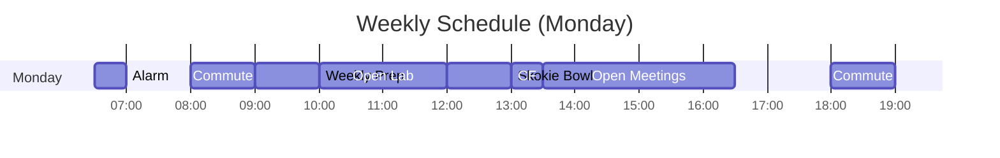
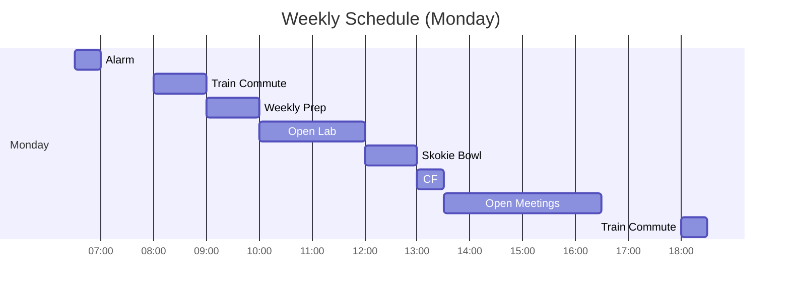
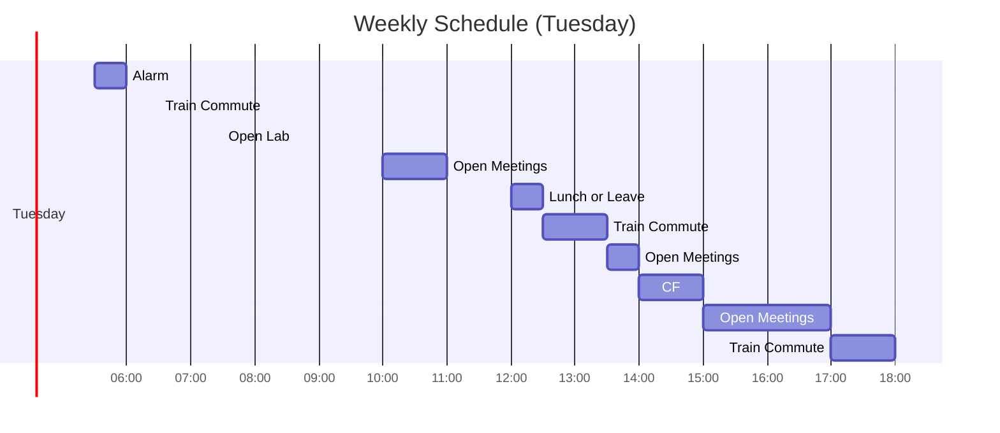

# Notes

## Using gpt to make the mermaid from a csv of my timeblocking


- Fascinating that the compact works this way lol

```
---
displayMode: compact
---
```
- But I was inspired to try
	- Quarto noted that this was in Mermaid 10.4, 
		- https://github.com/quarto-dev/quarto-cli/issues/6971
		- "Also note that the "frontmatter config" is only available in mermaid.js v10.4.0."
	- Obsidian noted they updated to 10.6 in Nov 2023
		- https://forum.obsidian.md/t/recurrent-upgrade-mermaid-js-to-the-latest-version-x-y-z/65374/13
- I've got some other css applying that is allowing me to stretch the image, but I'm not sure that I care for it.

### Styling

https://forum.obsidian.md/t/how-to-style-gantt-chart-mermaid/47883/5

### GPT
You are an expert at Javascript, please help me make a gantt chart using mermaidjs to show my weekly schedule in a single section. Please look at the below example

gantt chart gantt dateFormat HH:mm axisFormat %H:%M Initial milestone : milestone, m1, 17:49, 2m Task A : 10m Task B : 5m Final milestone : milestone, m2, 18:08, 4m 

Now use the following CSV to make a mermaid gantt chart with a single section for each segment of my day, please interpret blocks of the same task as a single continous task. 

Time,Monday,Tuesday 5:00 AM,, 5:30 AM,,Alarm 6:00 AM,, 6:30 AM,Alarm,Train Commute 7:00 AM,,Train Commute 7:30 AM,,Open Lab 8:00 AM,Train Commute,Open Lab 8:30 AM,Train Commute,Open Lab 9:00 AM,Weekly Prep,Open Lab 9:30 AM,Weekly Prep,Open Lab 10:00 AM,Open Lab,Open Meetings 10:30 AM,Open Lab,Open Meetings 11:00 AM,Open Lab,Open Meetings 11:30 AM,Open Lab,Open Meetings 12:00 PM,Skokie Bowl,Lunch or Leave 12:30 PM,Skokie Bowl,Train Commute 1:00 PM,CF,Open Meetings 1:30 PM,Open Meetings,Open Meetings 2:00 PM,Open Meetings,CF 2:30 PM,Open Meetings,CF 3:00 PM,Open Meetings,Open Meetings 3:30 PM,Open Meetings,Open Meetings 4:00 PM,Open Meetings,Open Meetings 4:30 PM,Open Meetings,Open Meetings 5:00 PM,,Train Commute 5:30 PM,,Train Commute 6:00 PM,Train Commute, 6:30 PM,Train Commute,

To create a MermaidJS Gantt chart from your CSV data, we'll transform the timeslots for Monday and Tuesday into the appropriate syntax required by MermaidJS. As per your instructions, blocks of the same task will be interpreted as a single continuous task.

Since Gantt charts in MermaidJS require a start date, I'll assume an arbitrary date—let's say the current date, which you can replace as needed—to anchor the times given for the tasks.

Here's the interpreted MermaidJS Gantt chart configuration for Monday:

```mermaid
gantt
    dateFormat  HH:mm
    axisFormat %H:%M
    title Weekly Schedule (Monday)
    
    section Monday
    Alarm : 6:30 AM, 30m
    Train Commute : 8:00 AM, 1h
    Weekly Prep : 9:00 AM, 1h
    Open Lab : 10:00 AM, 2h
    Skokie Bowl : 12:00 PM, 1h
    CF : 1:00 PM, 30m
    Open Meetings : 1:30 PM, 3h
    Train Commute : 6:00 PM, 30m
```

And for Tuesday:

```mermaid
gantt
    dateFormat  HH:mm
    axisFormat %H:%M
    title Weekly Schedule (Tuesday)
    
    section Tuesday
    Alarm : 5:30 AM, 30m
    Train Commute : 6:30 AM, 1h 30m
    Open Lab : 7:30 AM, 2h 30m
    Open Meetings : 10:00 AM, 1h
    Lunch or Leave : 12:00 PM, 30m
    Train Commute : 12:30 PM, 1h
    Open Meetings : 1:30 PM, 30m
    CF : 2:00 PM, 1h
    Open Meetings : 3:00 PM, 2h
    Train Commute : 5:00 PM, 1h
```

Please note that the duration of each activity was determined based on the continuous blocks of tasks. You might need to adjust the dates, as I've set them all to the current day and assumed a single day chart for simplicity.

You should add this syntax to a mermaid block within an environment where MermaidJS is supported. Such as markdown files on platforms like GitHub or GitLab, or in tools that render MermaidJS diagrams directly.

Remember, depending on the tool you use to view the MermaidJS diagram, you might need to update the date format `dateFormat` directive. The above assumes a 24-hour clock for both the date format and axis format. Adjust these as necessary for your actual use case.

please reformat these to use 24 hour time and no AM/PM

Certainly, to use a 24-hour time format, we simply need to convert the times listed in your CSV to a 24-hour scale and remove the AM/PM designations. Here are your MermaidJS Gantt charts with times in a 24-hour format for Monday and Tuesday:

Monday's schedule:



Tuesday's schedule:



You can input these configurations into your Mermaid-compatible renderer to generate the Gantt charts for each day. Make sure to set the renderer or the tool to interpret the `dateFormat` properly so that the times are displayed correctly.


### More blocking 


| Time     | Monday      | Tuesday    | Wednesday  | Thursday  | Friday    | Saturday   | Sunday    | Monday     | Tuesday    | Wednesday  | Thursday  | Friday    | Saturday   | Sunday    |
| -------- | ----------- | ---------- | ---------- | --------- | --------- | ---------- | --------- | ---------- | ---------- | ---------- | --------- | --------- | ---------- | --------- |
| 5:00 AM  |             |            |            |           |           |            |           |            |            |            |           |           |            |           |
| 5:30 AM  |             | Alarm      |            | Alarm     |           |            |           |            | Alarm      |            | Alarm     |           |            |           |
| 6:00 AM  |             |            |            |           |           |            |           |            |            |            |           |           |            |           |
| 6:30 AM  | Alarm       | Commute    | Alarm      | Commute   | Alarm     |            |           | Alarm      | Commute    | Alarm      | Commute   | Alarm     |            |           |
| 7:00 AM  |             | Commute    |            | Commute   |           |            |           |            | Commute    |            | Commute   |           |            |           |
| 7:30 AM  |             | Work       |            | Work      |           |            |           |            | Work       |            | Work      |           |            |           |
| 8:00 AM  | Commute     | Work       |            | Work      |           | Partner    |           | Commute    | Work       |            | Work      |           | Partner    |           |
| 8:30 AM  | Commute     | Work       |            | Work      |           | Partner    |           | Commute    | Work       |            | Work      |           | Partner    |           |
| 9:00 AM  | Work        | Work       | Therapy    | Work      | Therapy   | Partner    | Self-Care | Work       | Work       | Therapy    | Work      | Therapy   | Partner    | Self-Care |
| 9:30 AM  | Work        | Work       | Therapy    | Work      | Therapy   | Partner    | Self-Care | Work       | Work       | Therapy    | Work      | Therapy   | Partner    | Self-Care |
| 10:00 AM | Work        | Work       |            | Work      |           | Partner    | Self-Care | Work       | Work       |            | Work      |           | Partner    | Self-Care |
| 10:30 AM | Work        | Work       | WFH        | Work      | Commute   | Partner    | Self-Care | Work       | Work       | WFH        | Work      | Commute   | Partner    | Self-Care |
| 11:00 AM | Work        | Work       | WFH        | Work      | Commute   | Productive | Partner   | Work       | Work       | WFH        | Work      | Commute   | Productive | Partner   |
| 11:30 AM | Work        | Work       | WFH        | Work      | Work      | Productive | Partner   | Work       | Work       | WFH        | Work      | Work      | Productive | Partner   |
| 12:00 PM | Lunch       | Commute    | WFH        | Lunch     | Work      | Productive | Partner   | Lunch      | Lunch      | WFH        | Lunch     | Work      | Productive | Partner   |
| 12:30 PM | Lunch       | Commute    | WFH        | Lunch     | Work      | Productive | Partner   | Lunch      | Commute    | WFH        | Lunch     | Work      | Productive | Partner   |
| 1:00 PM  | Work        | WFH        | WFH        | Work      | Work      | Productive | Partner   | Work       | WFH        | WFH        | Work      | Work      | Productive | Partner   |
| 1:30 PM  | Work        | WFH        | WFH        | Work      | Work      | Productive | Partner   | Work       | Work       | WFH        | Work      | Work      | Productive | Partner   |
| 2:00 PM  | Work        | WFH        | WFH        | Work      | Work      | Productive | Partner   | Work       | WFH        | WFH        | Work      | Work      | Productive | Partner   |
| 2:30 PM  | Work        | WFH        | WFH        | Work      | Work      | Productive | Partner   | Work       | Work       | WFH        | Work      | Work      | Productive | Partner   |
| 3:00 PM  | Work        | WFH        | WFH        | Work      | Work      | Productive | Partner   | Work       | WFH        | WFH        | Work      | Work      | Productive | Partner   |
| 3:30 PM  | Work        | WFH        | WFH        | Work      | Work      | Productive | Partner   | Work       | Work       | WFH        | Work      | Work      | Productive | Partner   |
| 4:00 PM  | Work        | WFH        | WFH        | Work      | Work      | Productive | Partner   | Work       | WFH        | WFH        | Work      | Work      | Productive | Partner   |
| 4:30 PM  | Work        | WFH        | WFH        | Work      | Work      | Productive | Chill     | Work       | Work       | WFH        | Work      | Work      | Productive | Chill     |
| 5:00 PM  | Work        | WFH        | WFH        | Commute   | Work      | Cooking    | Chill     | Work       | Commute    | WFH        | Commute   | Work      | Chill      | Chill     |
| 5:30 PM  | Work        | Cooking    | WFH        | Commute   | Work      | Cooking    | Chill     | Work       | Commute    | WFH        | Commute   | Work      | Chill      | Chill     |
| 6:00 PM  | Commute     | Cooking    | WFH        |           | Commute   | Cooking    | Chill     | Commute    |            | WFH        |           | Commute   | Chill      | Chill     |
| 6:30 PM  | Commute     | Cooking    | WFH        |           | Commute   | Cooking    | Chill     | Commute    |            | WFH        |           | Commute   | Chill      | Chill     |
| 7:00 PM  |             | Cooking    | Yoga       | RPGs      | Social    | Self-Care  | Self-Care |            | Yoga       | Yoga       | RPGs      | Social    | Chill      | Self-Care |
| 7:30 PM  | Yoga        | Non-work   | Non-work   | RPGs      | Social    | Self-Care  | Self-Care | Non-work   | Non-work   | Non-work   | RPGs      | Social    | Chill      | Self-Care |
| 8:00 PM  | Family Chat | Activities | Activities | RPGs      | Social    | Self-Care  | Self-Care | Activities | Activities | Activities | RPGs      | Social    | Self-Care  | Self-Care |
| 8:30 PM  |             |            |            | RPGs      | Social    | Self-Care  | Self-Care |            |            |            | RPGs      | Social    | Self-Care  | Self-Care |
| 9:00 PM  | Wind-Down   | Wind-Down  | Wind-Down  | Wind-Down | Social    | Self-Care  | Wind-Down | Wind-Down  | Wind-Down  | Wind-Down  | RPGs      | Social    | Self-Care  | Wind-Down |
| 9:30 PM  |             |            |            |           | Social    | Self-Care  |           |            |            |            | RPGs      | Social    | Self-Care  |           |
| 10:00 PM | Bed Time    | Bed Time   | Bed Time   | Bed Time  | Wind-Down | Wind-Down  | Bed Time  | Bed Time   | Bed Time   | Bed Time   | Wind-Down | Wind-Down | Wind-Down  | Bed Time  |
| 10:30 PM |             |            |            |           |           |            |           |            |            |            |           |           |            |           |
| 11:00 PM |             |            |            |           | Bed Time  | Bed Time   |           |            |            |            | Bed Time  | Bed Time  | Bed Time   |           |

# Tasks
